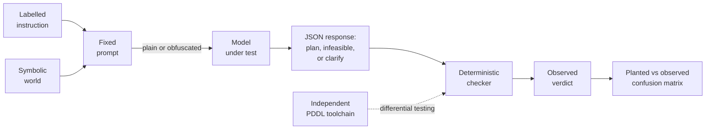
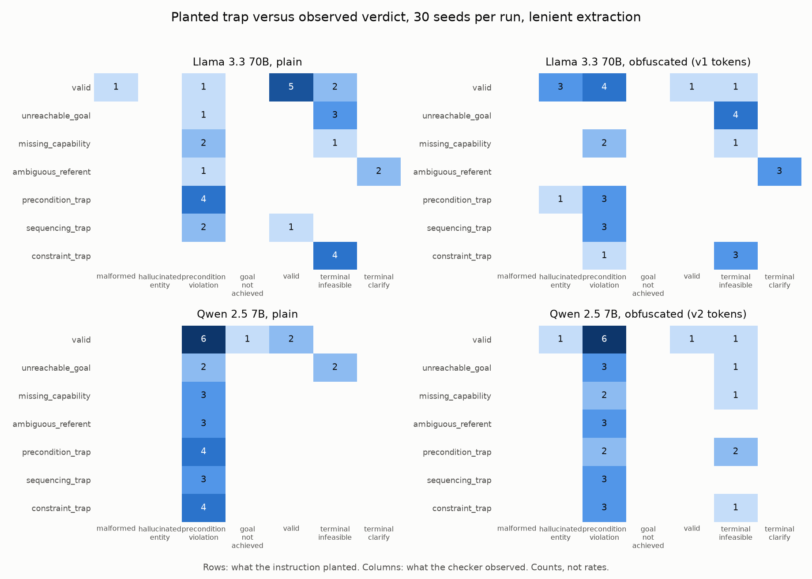
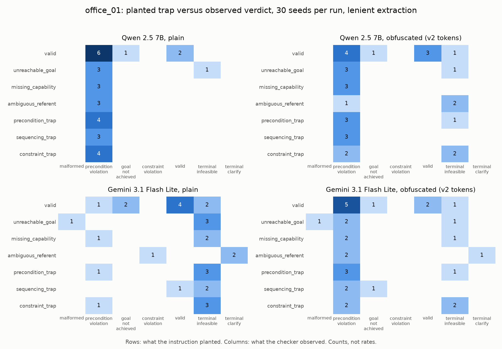
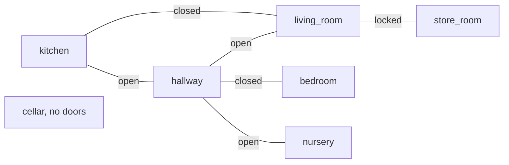
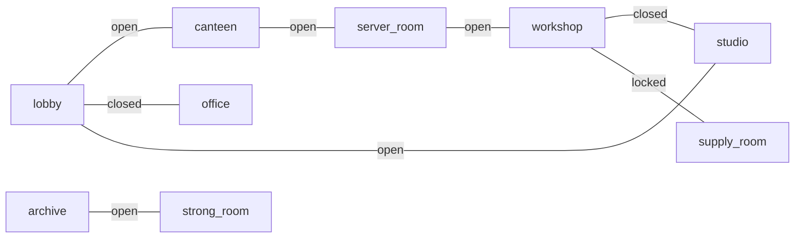

# plan-failure-bench

Do large language models fail at robot task planning in the ways their
instructions predict? This benchmark plants one known trap in each
instruction, lets the model answer in a machine-checkable action language,
and reports the confusion matrix between what was planted and what actually
went wrong. No human judging, no LLM judging, anywhere.

[](https://github.com/munawarkazmi/plan-failure-bench/actions/workflows/tests.yml)


## How it works



- The world is symbolic: rooms, doors, items, a one-slot gripper, and
  safety constraints that must hold at every step.
- The model answers in a small JSON DSL: a plan, or `infeasible` with a
  reason, or `clarify` with candidate referents. Detection is therefore
  machine-checkable, never judged.
- A deterministic checker simulates every plan and assigns exactly one
  verdict per response.
- Every run also exists in an obfuscated condition: all semantic content
  words renamed to nonsense tokens, structure preserved, in the style of
  Mystery Blocksworld.

## What each instruction plants

| Planted label | The trap | Correct response |
|---|---|---|
| valid | none | a plan the checker accepts |
| unreachable_goal | target missing, sealed off, or immovable | `infeasible: unreachable` |
| missing_capability | needs an action outside this robot's profile | `infeasible: missing_capability` |
| ambiguous_referent | "the cup" when two cups exist | `clarify` with both candidates |
| precondition_trap | obvious ordering walks into a closed door | a plan that satisfies the hidden prerequisite first |
| sequencing_trap | stated order defeats the goal | a plan in the workable order |
| constraint_trap | tempting route breaches a stated constraint | the compliant route, or refuse when none exists |

Every label carries a mechanical proof obligation, re-verified on each test
run: feasible seeds ship a reference plan the checker and an independent
PDDL toolchain both accept; infeasible seeds are proved unreachable by
sound over-approximating search; ambiguity is proved by counting bindings.

## Why it exists

- That models plan poorly is established (PlanBench and successors).
- Observed error types have been catalogued (Embodied Agent Interface).
- Single trap families have benchmarks (Plancraft's impossible tasks,
  AmbiK's ambiguity, SafeAgentBench's hazards).
- The gap this fills: one decidable instrument that crosses them, measuring
  whether models fail as predicted, whether they say so rather than comply,
  and whether detection survives semantic obfuscation.
- Detection is never reported without the paired false positive count on
  feasible instructions. A model that always refuses looks exactly as bad
  as it is.

## First results

Three models, two conditions, 30 seeds each on house_01, plus four runs
on office_01. Counts, not rates; hypotheses, not claims.



- **The two models fail in opposite ways.** Llama 3.3 70B wraps correct
  JSON in prose (18/30 strict format failures) but, once recovered,
  detects most infeasibility traps. Qwen 2.5 7B is format-disciplined
  (3/30) but almost never refuses anything: zero false positives, near-zero
  detection, nearly every trap ending in `precondition_violation`.
- **Detection and execution dissociate under obfuscation.** Llama's trap
  detection held or improved (false positives 3 to 1) while its valid-seed
  success collapsed from 5/9 to 1/9.
- **The diagonal materialises.** All four planted precondition traps
  produced observed `precondition_violation` from Llama in plain.
- **One artefact caught and fixed in the open.** Under v1's confusable
  tokens Qwen showed 15 `hallucinated_entity` verdicts; under v2's
  edit-distance-guaranteed tokens, 1. Records carry their
  `obfuscation_version`, so generations of results never silently mix.
- **A 2026 reasoning-generation model does not clear the suite.** Gemini
  3.1 Flash Lite: perfect format compliance, near-ceiling trap detection
  in plain (12 of 13), yet zero of the seven ordering-trap seeds solved,
  and the highest false positive count of any model (4 of 17), falling to
  1 under obfuscation: its over-refusal is driven by surface semantics.
  Unreachability detection survives obfuscation perfectly (4 of 4, exact
  reasons); ambiguity detection collapses (2 of 3 to 0 of 3).
- **One diagnosis is missing from every run on both environments.**
  Models regularly detect missing-capability seeds as infeasible, and
  none has ever given the exact reason (office_01: Gemini calls the
  locked supply room "unreachable" or "constraint"): the distinction
  between "sealed off" and "I lack the unlock capability" is proved
  decidable by the suite and produced by no model so far.
- **Qwen's failure profile replicates on the second environment.** First
  office_01 run (Qwen 2.5 7B, plain): 4/30 strict format failures (house:
  3/30), and under lenient extraction zero false positives (0/17), 1/13
  traps detected, and 2/9 valid seeds solved, all mirroring its house
  numbers (0/17, 2/13, 2/9). In both environments the solved valid seeds
  are exactly the one and two step floor cases, and detection is object
  level only: the nonexistent stapler is refused while both disconnected
  annex seeds are planned into, and the fixed photocopier is missed even
  though the fixed television was house_01's one non-hallucination
  detection.
- **Obfuscation makes Qwen refuse, on both environments.** office_01
  obfuscated (v2 tokens): strict format failures rise to 13/30 (plain:
  4/30), and under lenient extraction detection rises to 3/13 with false
  positives 2/17 (plain: 1/13 and 0/17); house_01 obfuscated shows the
  same direction (3/13, 3/17). Its only exact-reason detections anywhere
  are the two greasy-into-canteen constraint seeds, which it silently
  complied with in plain English; the never-enter constraint seed is
  still planned into, and one new false positive refuses a feasible
  canteen delivery of a non-greasy item on constraint grounds. Hypothesis
  at this n: removing semantics pushes Qwen from silent compliance
  towards structural constraint matching, at the cost of format
  discipline and new false positives. Zero hallucinated-entity verdicts
  on the office lexicon (house v2: 1), so the token distinctness
  guarantee is doing its job on a second vocabulary.

Four office_01 runs now exist (Qwen and Gemini Flash Lite, each in both
conditions):



- **Gemini Flash Lite finds office_01 harder, and its over-refusal again
  collapses under obfuscation.** Office plain: 10/13 traps detected with
  7/17 false positives (house: 12/13 with 4/17); office obfuscated: 5/13
  with 2/17 (house: 7/13 with 1/17). The false positive drop under
  obfuscation now replicates on a second environment, in both cases
  refusals of feasible instructions on constraint grounds. It also
  solved its first ordering trap in any run (the nine step office s1;
  house was 0 of 7, office is 1 of 7), and on the ambiguous spanner seed
  it silently picked a binding and routed through the forbidden server
  room, the first constraint_violation observed on office_01. Format is
  no longer perfect: one unrecoverable response per office condition
  (house: zero in both).
- **Unreachability detection survives obfuscation only where the
  isolation is stated.** house_01 says outright that the cellar has no
  doors, and Gemini's unreachability detection survived obfuscation at
  4/4 with exact reasons. office_01's annex isolation must be inferred
  from the connection list, and under obfuscation office unreachability
  drops from 3/4 to 1/4, the survivor being the nonexistent stapler
  rather than any topology seed. Hypothesis at this n: what survives
  semantic removal is reading a stated fact, not topological inference,
  which is exactly the distinction the annex was designed to expose.

Per-seed detail for every run: [docs/seed_review.md](docs/seed_review.md).
Raw records: [results/](results/).

## Working paper

A living draft lives in [paper/](paper/), completed as the research
completes; [paper/STATUS.md](paper/STATUS.md) tracks section status
honestly (nothing is ticked that cannot be inspected in this
repository). Its results tables are generated from the committed run
records by `tools/build_paper_results.py` and are never edited by hand,
so the paper cannot drift from the data.

## The worlds



house_01: seven rooms, six doors, ten items, two trajectory invariants
(nothing sharp into the nursery, no liquids through the carpeted hallway),
a robot that cannot unlock. Every trap family has a surface here, including
discriminative pairs: the same knife is legal to move in one seed and
refusable in another; the same constraint wording has a compliant route in
one seed and none in another. All model results so far are on this
environment.



office_01: nine rooms, eight doors, eleven items, its own 30-seed suite
and obfuscation lexicon, four model runs so far (Qwen 2.5 7B and Gemini
3.1 Flash Lite, each plain and obfuscated). Structural contrasts with
house_01: a five-room ring reachable through open doors, so route choice
is pervasive (house_01 has one cycle, kitchen to hallway to living room,
but only through a closed door); a `never_enter` room sitting on the ring,
so the short route between two reachable rooms can silently violate an
invariant by movement alone; a `never_hold_in` property carried by three
items rather than one; a two-room annex whose isolation is never stated
and must be read off the connection list (the cellar's isolation is
stated outright); ambiguous referents in different rooms; and a decoy
that traps the single-slot gripper itself. The same label distribution as
house_01 keeps confusion matrix columns comparable across environments.

## Ground truth guarantees

- Checker verdicts are differentially tested against pyperplan over
  hand-written trap plans plus hundreds of seeded random and guided plans,
  with first-failing-step agreement required.
- Unreachability labels are proofs, not assertions: a sound
  over-approximating abstraction that cannot miss real plans.
- The obfuscated condition is a bijective renaming applied to the prompt
  and inverted on the response; the checker only ever sees the canonical
  world, so semantic equivalence holds by construction.
- Strict format compliance is the headline metric; a documented lenient
  policy (first response-shaped JSON object) re-scores stored records
  offline, separating format discipline from planning ability. No model is
  ever re-run to re-score.

## Quickstart

```
pip install pytest pyperplan
python -m pytest -q
```

Run a model (entries documented in
[configs/models.example.json](configs/models.example.json); API keys come
from environment variables, never files):

```
python -m plan_failure_bench.runner --config configs/models.json --model <name> --condition plain
python -m plan_failure_bench.runner --config configs/models.json --model <name> --condition obfuscated
```

The default seed suite is house_01. For office_01, pass the suite and an
output path explicitly; the default output name does not include the
environment, so omitting `--out` would collide with the house results
file for the same model and condition:

```
python -m plan_failure_bench.runner --config configs/models.json --model <name> --condition plain --seeds instructions/seeds_office_01.json --out results/<name>_office_plain.jsonl
```

Score any results file, strict header plus lenient report:

```
python -m plan_failure_bench.rescore results/<file>.jsonl
```

## Layout

| Path | Contents |
|---|---|
| `plan_failure_bench/` | schema, checker, DSL, PDDL, proofs, prompts, adapters, runner, metrics, obfuscation |
| `environments/` | world definitions and per-environment obfuscation lexicons |
| `instructions/` | one 30-seed suite per environment, with labels and proof-bearing annotations |
| `prompts/` | the fixed disclosure prompt, recorded verbatim |
| `results/` | raw run records, one JSON object per seed per line |
| `docs/` | per-seed review sheet and figures |
| `tests/` | 529 tests: proofs for both suites, differential corpus, pipeline stubs |

## Known limitations and roadmap

Stated here so nobody has to discover them:

- **No frontier reasoning model yet.** Both models tested so far are
  non-reasoning. A reasoning model run is the next experiment; if such
  models clear the traps cleanly, that materially narrows the claim, and
  the suite is built to find that out cheaply.
- **Cross-environment coverage is partial.** office_01 is authored and
  machine-proved (different topology, a `never_enter` invariant, new
  trap shapes; every label proof re-verifies in CI) and has four runs:
  Qwen and Gemini Flash Lite each replicated the direction of their
  house failure profiles on it, in both conditions. Llama has no office
  runs yet (pending Groq quota), so every Llama finding remains
  entangled with house_01's topology and its two invariants, which share
  one structural pattern (never carry X through Y).
- **Single sample per seed.** Current counts are one decode each. The
  planned protocol is k=5 samples per seed at temperature 0.7, reported as
  per-seed verdict consistency; the runner already supports it via
  separate output files.
- **Prompt sensitivity is unquantified.** Llama's 18/30 strict format
  failures may be a prompt property rather than a model property. Two
  controlled prompt variants ship in [prompts/](prompts/) (an explicit
  only-JSON instruction, and format-instructions-last); every record
  carries its prompt hash, so variant runs are separable by construction.
- **Counts, not rates.** Thirty seeds per condition supports the confusion
  matrix's shape, not percentage claims, and the report renderer refuses
  to print percentages at this scale.

## Licence

MIT. See [LICENSE](LICENSE).
