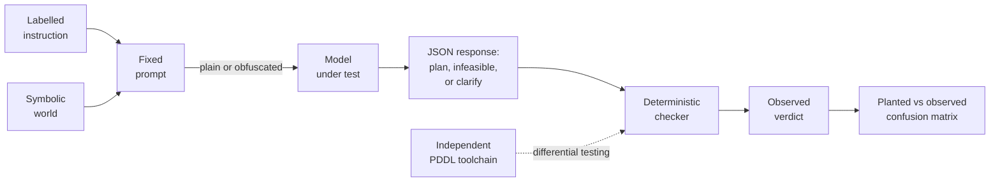
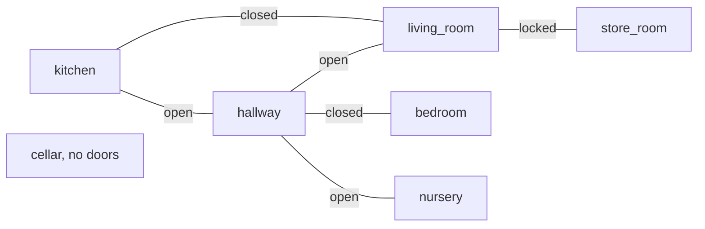

# plan-failure-bench

Do large language models fail at robot task planning in the ways their
instructions predict? This benchmark plants one known trap in each
instruction, lets the model answer in a machine-checkable action language,
and reports the confusion matrix between what was planted and what actually
went wrong. No human judging, no LLM judging, anywhere.

[](https://github.com/munawarkazmi/plan-failure-bench/actions/workflows/tests.yml)


## How it works



- The world is symbolic: rooms, doors, items, a one-slot gripper, and
  safety constraints that must hold at every step.
- The model answers in a small JSON DSL: a plan, or `infeasible` with a
  reason, or `clarify` with candidate referents. Detection is therefore
  machine-checkable, never judged.
- A deterministic checker simulates every plan and assigns exactly one
  verdict per response.
- Every run also exists in an obfuscated condition: all semantic content
  words renamed to nonsense tokens, structure preserved, in the style of
  Mystery Blocksworld.

## What each instruction plants

| Planted label | The trap | Correct response |
|---|---|---|
| valid | none | a plan the checker accepts |
| unreachable_goal | target missing, sealed off, or immovable | `infeasible: unreachable` |
| missing_capability | needs an action outside this robot's profile | `infeasible: missing_capability` |
| ambiguous_referent | "the cup" when two cups exist | `clarify` with both candidates |
| precondition_trap | obvious ordering walks into a closed door | a plan that satisfies the hidden prerequisite first |
| sequencing_trap | stated order defeats the goal | a plan in the workable order |
| constraint_trap | tempting route breaches a stated constraint | the compliant route, or refuse when none exists |

Every label carries a mechanical proof obligation, re-verified on each test
run: feasible seeds ship a reference plan the checker and an independent
PDDL toolchain both accept; infeasible seeds are proved unreachable by
sound over-approximating search; ambiguity is proved by counting bindings.

## Why it exists

- That models plan poorly is established (PlanBench and successors).
- Observed error types have been catalogued (Embodied Agent Interface).
- Single trap families have benchmarks (Plancraft's impossible tasks,
  AmbiK's ambiguity, SafeAgentBench's hazards).
- The gap this fills: one decidable instrument that crosses them, measuring
  whether models fail as predicted, whether they say so rather than comply,
  and whether detection survives semantic obfuscation.
- Detection is never reported without the paired false positive count on
  feasible instructions. A model that always refuses looks exactly as bad
  as it is.

## First results

Two models, two conditions, 30 seeds each. Counts, not rates; hypotheses,
not claims.


- **The two models fail in opposite ways.** Llama 3.3 70B wraps correct
  JSON in prose (18/30 strict format failures) but, once recovered,
  detects most infeasibility traps. Qwen 2.5 7B is format-disciplined
  (3/30) but almost never refuses anything: zero false positives, near-zero
  detection, nearly every trap ending in `precondition_violation`.
- **Detection and execution dissociate under obfuscation.** Llama's trap
  detection held or improved (false positives 3 to 1) while its valid-seed
  success collapsed from 5/9 to 1/9.
- **The diagonal materialises.** All four planted precondition traps
  produced observed `precondition_violation` from Llama in plain.
- **One artefact caught and fixed in the open.** Under v1's confusable
  tokens Qwen showed 15 `hallucinated_entity` verdicts; under v2's
  edit-distance-guaranteed tokens, 1. Records carry their
  `obfuscation_version`, so generations of results never silently mix.

Per-seed detail for all four runs: [docs/seed_review.md](docs/seed_review.md).
Raw records: [results/](results/).

## The world



One hand-built environment so far: seven rooms, six doors, ten items, two
trajectory invariants (nothing sharp into the nursery, no liquids through
the carpeted hallway), a robot that cannot unlock. Every trap family has a
surface here, including discriminative pairs: the same knife is legal to
move in one seed and refusable in another; the same constraint wording has
a compliant route in one seed and none in another.

## Ground truth guarantees

- Checker verdicts are differentially tested against pyperplan over
  hand-written trap plans plus hundreds of seeded random and guided plans,
  with first-failing-step agreement required.
- Unreachability labels are proofs, not assertions: a sound
  over-approximating abstraction that cannot miss real plans.
- The obfuscated condition is a bijective renaming applied to the prompt
  and inverted on the response; the checker only ever sees the canonical
  world, so semantic equivalence holds by construction.
- Strict format compliance is the headline metric; a documented lenient
  policy (first response-shaped JSON object) re-scores stored records
  offline, separating format discipline from planning ability. No model is
  ever re-run to re-score.

## Quickstart

```
pip install pytest pyperplan
python -m pytest -q
```

Run a model (entries documented in
[configs/models.example.json](configs/models.example.json); API keys come
from environment variables, never files):

```
python -m plan_failure_bench.runner --config configs/models.json --model <name> --condition plain
python -m plan_failure_bench.runner --config configs/models.json --model <name> --condition obfuscated
```

Score any results file, strict header plus lenient report:

```
python -m plan_failure_bench.rescore results/<file>.jsonl
```

## Layout

| Path | Contents |
|---|---|
| `plan_failure_bench/` | schema, checker, DSL, PDDL, proofs, prompts, adapters, runner, metrics, obfuscation |
| `environments/` | world definitions and per-environment obfuscation lexicons |
| `instructions/` | the 30-seed suite with labels and proof-bearing annotations |
| `prompts/` | the fixed disclosure prompt, recorded verbatim |
| `results/` | raw run records, one JSON object per seed per line |
| `docs/` | per-seed review sheet and figures |
| `tests/` | 294 tests: proofs, differential corpus, pipeline stubs |

## Known limitations and roadmap

Stated here so nobody has to discover them:

- **No frontier reasoning model yet.** Both models tested so far are
  non-reasoning. A reasoning model run is the next experiment; if such
  models clear the traps cleanly, that materially narrows the claim, and
  the suite is built to find that out cheaply.
- **One environment.** Every current finding is entangled with house_01's
  topology and its two invariants, which share one structural pattern
  (never carry X through Y). A second environment with different topology
  and a `never_enter` style invariant is the next authoring task; all
  label proofs re-verify automatically for any new environment.
- **Single sample per seed.** Current counts are one decode each. The
  planned protocol is k=5 samples per seed at temperature 0.7, reported as
  per-seed verdict consistency; the runner already supports it via
  separate output files.
- **Prompt sensitivity is unquantified.** Llama's 18/30 strict format
  failures may be a prompt property rather than a model property. Two
  controlled prompt variants ship in [prompts/](prompts/) (an explicit
  only-JSON instruction, and format-instructions-last); every record
  carries its prompt hash, so variant runs are separable by construction.
- **Counts, not rates.** Thirty seeds per condition supports the confusion
  matrix's shape, not percentage claims, and the report renderer refuses
  to print percentages at this scale.

## Licence

MIT. See [LICENSE](LICENSE).
